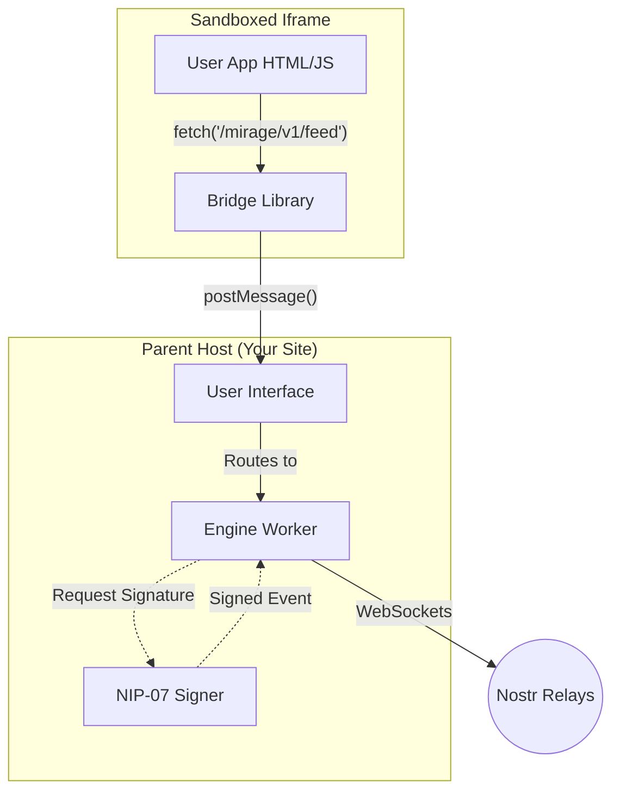

# 🏜️ Mirage: The Nostr App Engine

> **Build serverless, decentralized apps using nothing but HTML, JavaScript, and an AI prompt.**

Mirage is a runtime environment that allows "micro-apps" to run entirely on the Nostr network. It abstracts the complexity of relays, cryptography, and NIPs into a **Virtual REST API**.

This allows developers (and AI agents) to build feature-rich social and data apps using standard `fetch()` calls, unaware that the "backend" is actually a decentralized protocol running inside a Web Worker.

## ⚡ Key Features

* **The Virtual API:** A standardized REST surface (`/mirage/v1/feed`, `/mirage/v1/storage`) that automatically translates HTTP requests into Nostr events.
* **Real-Time Streaming:** Use `EventSource` for live data - no polling required.
* **True Serverless:** Apps are stored as Nostr events (Kind 30xxx) and run locally. No AWS, no Vercel, no backend maintenance.
* **AI-Native Design:** The API is designed to be "self-documenting" for LLMs. You can prompt an AI: *"Make a grocery list app using the Mirage API"* and it will work instantly.
* **Zero-Knowledge Security:** Apps run in a sandboxed `iframe` with a `null` origin. They **never** touch the user's private keys.
* **Family-Ready:** Built-in support for encrypted spaces and NIP-17 encryption allows for private, shared apps (e.g., "Family Chores" or "Team Notes").
* **PWA Support:** Mirage Studio is installable as a Progressive Web App on desktop and mobile devices.

## 🏗️ Architecture

Mirage uses a **Host-Owned Engine** architecture where the parent website owns the Nostr connection, allowing background sync even when apps are closed.



1. **The Host:** Owns the Engine Worker. Manages relay connections and NIP-07 signing.
2. **The Bridge:** Intercepts `fetch()` and `EventSource` in the app and routes to Host via `postMessage`.
3. **The Engine:** Web Worker that handles API requests, maintains relay subscriptions, and manages streaming.

## 📖 The Virtual API

### Quick Start

```javascript
// Get recent posts (Kind 1)
const posts = await fetch('/mirage/v1/events?kinds=1&limit=20').then(r => r.json());

// Stream live updates
const stream = new EventSource('/mirage/v1/events?kinds=1');
stream.onmessage = (e) => console.log(JSON.parse(e.data));

// Save app data
await fetch('/mirage/v1/storage/settings', {
  method: 'PUT',
  body: JSON.stringify({ theme: 'dark' })
});
```

### Endpoints

| Endpoint | Method | Description |
| --- | --- | --- |
| `/mirage/v1/ready` | `GET` | Check if system is ready |
| `/mirage/v1/events` | `GET/POST` | Query or Publish Nostr events (Native) |
| `/mirage/v1/user/me` | `GET` | Get current user profile |
| `/mirage/v1/profiles/:pubkey` | `GET` | Get user by public key |
| `/mirage/v1/storage/:key` | `GET/PUT/DELETE` | App data storage |
| `/mirage/v1/spaces/:id/store` | `GET/PUT` | Shared Key-Value Store (Database) |
| `/mirage/v1/spaces/:id/messages` | `GET/POST` | Private group messages |
| `/mirage/v1/dm/:pubkey` | `GET/POST` | Encrypted direct messages |
| `/mirage/v1/contacts` | `GET/PUT` | NIP-02 Contact Lists |

> **Streaming:** `GET` endpoints for events, spaces, and DMs support `EventSource` for real-time updates.

## 🛡️ Security Model

Mirage implements a strict **"Air Gap"** between the app logic and user secrets.

1. **Iframe Sandbox:** Apps are loaded via `srcdoc` with `sandbox="allow-scripts"`. They cannot access cookies, local storage, or the parent DOM.

2. **Permission Manifest:** Apps declare intent via meta tags:
   ```html
   <meta name="mirage-permissions" content="public_read, storage_read, space_read">
   ```

3. **User Consent:** When an app tries to sign an event, the Host receives the request and can prompt the user. Private keys never enter the iframe.

## 🧩 Supported NIPs

| NIP | Feature | Usage in Mirage |
| --- | --- | --- |
| **01** | Basic Protocol | Events, Metadata, Text Notes |
| **07** | Browser Signer | Delegating key operations to extensions |
| **17** | Private DMs | Encrypted messaging |
| **02** | Contact List | Manage follows/friends |
| **44** | Encryption | NIP-44 v2 encryption for spaces |
| **78** | App Data | Arbitrary JSON storage for apps |

## 🎨 App Preview Mode

Mirage includes a built-in **preview mode** for testing apps before publishing to relays:

* **In-Memory Testing:** Preview apps run with a special `__preview__` identifier
* **Mock Data Handling:** POST/GET requests work in-memory without NIP-07 signing
* **Realistic Simulation:** 350ms delay on GET requests simulates network latency
* **Iterative Development:** Edit code → Preview → Edit → Preview → Publish

This allows developers and AI agents to rapidly iterate on apps without polluting the Nostr network with test data.

## 🚀 Getting Started

### Installation

```bash
npm install @mirage/host @mirage/core
```

### Usage

```javascript
import { MirageHost } from '@mirage/host';

const host = new MirageHost({
  signer: window.nostr, 
  relays: ['wss://relay.damus.io', 'wss://nos.lol'],
  engineUrl: '/path/to/engine.js',
  bridgeUrl: '/path/to/bridge.js'
});

// Mount an app
host.mount(appHtml, document.getElementById('app-container'));
```

## 🎮 Demo Pages

Run a local server (`python3 -m http.server` or `bunx serve .`) and open:

| Demo | Path | Description |
|------|------|-------------|
| **Events Debugger** | `/examples/events-demo.html` | **New!** Test generic `GET/POST /events` API. |
| **Spaces Demo** | `/examples/spaces-demo.html` | **New!** Test encrypted spaces & invites. |
| **DM Demo** | `/examples/dm-demo.html` | **New!** Send/Receive NIP-17 Direct Messages. |
| **Sample App** | `/examples/sample-app.html` | Hosted app using `/events` feed (Needs Host). |
| **Storage Demo** | `/examples/storage-demo.html` | Test encrypted storage (NIP-44). |
| **Contacts Demo** | `/examples/contacts-demo.html` | **New!** Manage NIP-02 Contact Lists. |
| **Host Demo** | `/examples/demo-host.html` | Full Host + Sample App integration. |

## 🗺️ Roadmap

* [x] **Phase 1: Core Engine** ✅ (Fetch Proxy, Web Worker, NIP-01/07)
* [x] **Phase 2: Persistence Layer** ✅ (NIP-78 Storage)
* [x] **Phase 3: Streaming Layer** ✅ (SSE, Host-owned Engine, Background Sync)
* [x] **Phase 4: Encryption** ✅ (NIP-44 storage encryption, both modes)
* [x] **Phase 5: Spaces** ✅ (Encrypted shared spaces)
* [x] **Phase 6: DMs** ✅ (NIP-17 direct messages)
* [x] **Phase 7: Contacts** ✅ (NIP-02 Contact Lists)

## 📄 License

MIT

