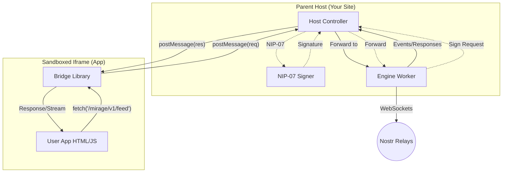
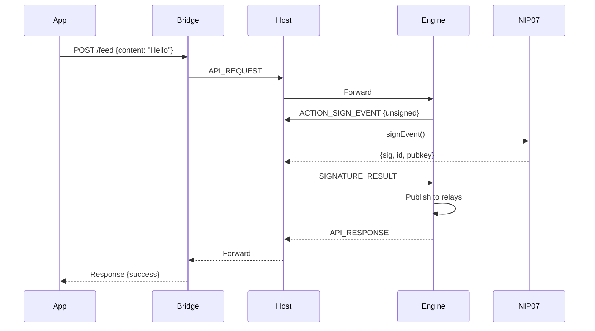

# Technical Overview: The Nostr App Engine

## 1. Executive Summary

The Nostr App Engine is a client-side platform that enables the creation and execution of "serverless" micro-apps. These apps are generated by AI, stored as Nostr events, and executed within a secure, sandboxed browser environment.

The core innovation is a **"Virtual API"** layer. This abstracts the complexity of the Nostr protocol (relays, cryptography, NIPs) into standard RESTful endpoints with real-time streaming support.

---

## 2. System Architecture

The system utilizes a **Host-Owned Engine** pattern where the parent website owns the Nostr connection, enabling background sync and persistent subscriptions.

### Component Diagram



### The Three Layers

1. **The Host (Parent Website)**
   - **Role:** The "Browser OS"
   - **Owns:** The Engine Worker (persistent across app changes)
   - **Responsibilities:** Loads apps, manages NIP-07 signing, routes messages
   - **Security:** Only layer with access to private keys

2. **The Bridge (Injected Library)**
   - **Role:** The "Interceptor"
   - **Mechanism:** Intercepts `fetch()` and `EventSource` calls to `/mirage/` namespace
   - **Modes:** 
     - **Child Mode:** Routes to parent Host via `postMessage`
     - **Standalone Mode:** Spawns own Engine Worker (for development)

3. **The Engine (Web Worker)**
   - **Role:** The "Virtual Backend"
   - **Responsibilities:** Maintains relay connections, serializes to Nostr events, manages subscriptions
   - **Streaming:** Pushes events to Bridge via `STREAM_CHUNK` messages

---

## 3. The "Virtual Database" (Shared KV Store)

A key feature for AI-generated apps is the **Shared Key-Value Store**. This allows apps to have state (like a Todo list) without needing a SQL database.

### Protocol Details
*   **Events:** Kind 42 (Channel Message)
*   **Tags:** `#t=mirage_store`
*   **Content:** `["store_put", "key_name", { "json": "value" }]`
*   **Conflict Resolution:** Last-Write-Wins (LWW) per key.

### Engine Logic
The Engine automatically "flattens" the stream of events into a single JSON object state.
1.  **Snapshot:** Engine caches the latest state.
2.  **Merge:** New events overwrite old keys based on timestamp.
3.  **Read:** `GET /space/store` returns the clean, merged JSON for the current Space.

---

## 4. The Virtual API

All endpoints use the `/mirage/v1/` prefix.

### Public & Social

Use these endpoints to build open social features like global feeds, user discovery, and public profiles. These actions are performed by the user and are visible to the entire network.

| Method | Endpoint | Streaming | Description |
|--------|----------|-----------|-------------|
| `GET` | `/ready` | No | Check system status |
| `GET` | `/user/me` | No | Current user profile |
| `GET` | `/profiles/{pubkey}` | No | User by public key (Standard) |
| `GET` | `/users/{pubkey}` | No | User by public key (Alias) |
| `GET` | `/events` | **Yes** | Query Nostr events |
| `POST` | `/events` | No | Publish a Nostr event |
| `GET` | `/feed` | **Yes** | Public timeline (Alias) |
| `POST` | `/feed` | No | Publish a note (Alias) |

### User Personal Storage (`/space/me`)

Use these endpoints for **personal, user-only data** within the current Space. This data is private to you and isolated per app. Even other members of the Space cannot see this data unless you explicitly opt-in.

- **Isolation**: Scoped to (App + Space + User).
- **Encryption**: Data is encrypted (NIP-44) by default, meaning ONLY you can read it.
- **Why use this?**: For app settings, personal drafts, or bookmarks that don't belong in the shared team database.

| Method | Endpoint | Description |
|--------|----------|-------------|
| `GET` | `/space/me/{key}` | Retrieve your personal value |
| `PUT` | `/space/me/{key}` | Store/update personal value |
| `DELETE` | `/space/me/{key}` | Remove personal value |
| `?public=true` | *Query Param* | Stores in plaintext (e.g., for a space-specific profile others can read) |

### Private Spaces (Shared & Collaborative)

Use these endpoints for **multi-user collaboration** within a private group. This acts as the **Shared Database** for everyone in the Space.

- **Symmetry**: 
    - `/space/me`: **My** eyes only (Personal Storage).
    - `/space/store`: **Our** eyes only (Shared Space Database).
- **Implicit Context**: Apps automatically operate on the user's active Space. Ensure you've checked `/mirage/v1/space` to see if a context is active.

| Method | Endpoint | Streaming | Description |
|--------|----------|-----------|-------------|
| `GET` | `/space/store` | **Yes** | **Shared Key-Value Store** (Merged State) |
| `PUT` | `/space/store/{key}` | No | Update a specific key |
| `GET` | `/space/messages` | **Yes** | Group chat history |
| `POST` | `/space/messages` | No | Send message to the group |
| `POST` | `/space/invite` | No | **Invite Member (NIP-17)** |
| `GET` | `/space` | No | Get context (id, name, etc.) |
| `PUT` | `/space` | No | Manual context set (Standalone usage) |

### Administrative Endpoints

These endpoints are used for **system-level management** of spaces and applications. Access is strictly restricted to the Mirage management UI (`appOrigin === 'mirage'`). Regular applications cannot access these routes.

| Method | Endpoint | Description |
|--------|----------|-------------|
| `GET` | `/admin/spaces` | List all spaces owned by the user |
| `POST` | `/admin/spaces` | Create a new Space |
| `PUT` | `/admin/spaces/{id}` | Rename a Space |
| `DELETE` | `/admin/spaces/{id}` | Delete a Space |
| `GET` | `/admin/spaces/all` | List ALL spaces across all apps |
| `GET` | `/admin/apps` | List apps in the library |
| `POST` | `/admin/apps` | Add app to library |
| `DELETE` | `/admin/apps` | Remove app from library |

> [!TIP]
> For a full list of all available endpoints, request parameters, and response schemas, see the [OpenAPI Specification](file:///home/spiralnights/code/mirage/docs/openapi.yaml).

### Secure Sharing (Identity-Based)
Mirage uses **NIP-17 Gift Wraps** for sharing encrypted space keys. 
1. **Invite:** Alice wraps the symmetric key in a Kind 1059 Gift Wrap addressed to Bob's pubkey.
2. **Auto-Discovery:** Bob's Engine automatically scans for incoming wraps (looking back up to 7 days), decrypts them, and merges the new space keys into his local NIP-78 keychain.
3. **Background Sync:** The Engine Worker maintains a persistent polling loop (default 60s) to discover new invites even when the UI is idle.
4. **Soft Delete & Revival:** Deleting a shared space creates a local tombstone (`deleted: true`, `deletedAt`). If a new invite for the same space arrives with a `created_at` timestamp newer than the deletion, the space is automatically revived.
5. **Privacy:** Invites use Kind 13 rumors to ensure they do not clutter standard Nostr chat inboxes.

### Direct Messages (NIP-17)

Use these endpoints for **private 1-on-1 communication**. This implements the modern "sealed sender" model (NIP-17) which provides better metadata privacy than legacy NIP-04 DMs.

| Method | Endpoint | Streaming | Description |
|--------|----------|-----------|-------------|
| `GET` | `/dms` | No | List conversations |
| `GET` | `/dms/{pubkey}` | **Yes** | Get messages |
| `POST` | `/dms/{pubkey}` | No | Send message |

### Contact Lists (NIP-02)

Use these endpoints to manage the user's "Following" list. This is a global list shared across all Nostr clients.

| Method | Endpoint | Description |
|--------|----------|-------------|
| `GET` | `/contacts` | Get my follow list |
| `GET` | `/contacts/{pubkey}` | Get user's follow list |
| `PUT` | `/contacts` | Replace my follow list |

---

## 5. Authentication

Mirage supports multiple authentication mechanisms to accommodate different user setups.

### NIP-07 Browser Extensions

The primary authentication method uses [NIP-07](https://github.com/nostr-protocol/nips/blob/master/07.md) compatible browser extensions:

| Extension | Platform | Notes |
|-----------|----------|-------|
| Alby | Chrome, Firefox | Popular, supports Lightning |
| nos2x | Chrome | Lightweight |
| Nostr Connect | Mobile | Remote signing |

**Flow:**
1. User clicks "Login with Nostr"
2. Host calls `window.nostr.getPublicKey()`
3. Extension prompts user for permission
4. Public key returned, user authenticated

### WebAuthn PRF Credential Storage (Experimental)

For users without a browser extension, Mirage can encrypt and store credentials locally using the [WebAuthn PRF extension](https://www.w3.org/TR/webauthn-3/#prf-extension).

**How it works:**
1. User provides their nsec (private key)
2. WebAuthn PRF derives a stable encryption key from biometric authentication
3. The nsec is encrypted with AES-256-GCM and stored in localStorage
4. On subsequent visits, biometric prompt unlocks the credential

**Platform Compatibility:**

| Platform | Authenticator | PRF Support |
|----------|---------------|-------------|
| macOS | Touch ID | ✅ Supported |
| iOS | Face ID / Touch ID | ✅ Supported |
| Android | Chrome with fingerprint | ✅ Supported |
| Windows | Windows Hello | ❌ **Not Supported** |
| Any | YubiKey 5 series | ✅ Supported |
| Any | FIDO2 security key with hmac-secret | ✅ Supported |

> **Note:** Windows Hello lacks the `hmac-secret` capability required for PRF. Windows users should use a hardware security key or a NIP-07 extension.

---

## 6. App Preview Mode

### Overview
Mirage includes a dedicated preview environment for testing apps before publishing them to Nostr relays. This prevents test data from polluting the network and enables rapid iteration during development.

### Architecture

When an app is mounted with the special identifier `__preview__`, the bridge intercepts all `/mirage/` API requests and routes them to an in-memory mock handler instead of the engine:

```javascript
// In Bridge (fetch.ts)
if (currentAppOrigin === '__preview__') {
    return handlePreviewRequest(method, url, body);
}
```

### Mock Data Handler

The preview mock module (`preview-mock.ts`) provides:

* **In-Memory Storage:** `Map<string, any[]>` for channel data
* **Instant POST**: Data stored immediately without signing
* **Simulated GET**: 350ms delay to mimic network latency  
* **Session Isolation:** Data persists only during preview session

### Use Cases

1. **Rapid Prototyping:** Test UI/UX without relay round-trips
2. **AI Development:** LLMs can iterate on code without real data
3. **Feature Testing:** Verify app logic before committing to network
4. **Education:** Learn Mirage API without affecting production data

---

## 7. Security Model

### Origin Isolation

Apps run in an iframe with `srcdoc` and `sandbox="allow-scripts"`. This forces:
- `null` origin
- No localStorage/cookies access
- No parent DOM access

### The Vault Pattern (Client-Side Encryption)
For high-security apps (e.g., Password Managers), we use a "Client-Side Vault" pattern.
1.  **App Logic:** User enters a password -> App derives Key -> App encrypts data.
2.  **Engine Role:** Engine receives ciphertext -> Saves to Store (Public or Space-Encrypted).
3.  **Result:** Even if the Nostr Private Key (`nsec`) is leaked, the data remains secure because the App Password was never sent to the Engine.

### The Signing Flow



---

## 8. Implementation Status

| Phase | Status | Features |
|-------|--------|----------|
| Phase 1: Core Engine | ✅ Complete | Fetch proxy, Web Worker, NIP-01/07 |
| Phase 2: Storage | ✅ Complete | NIP-78 app data, Public/Private Support |
| Phase 3: Streaming | ✅ Complete | SSE, Host-owned Engine |
| Phase 4: Spaces | ✅ Complete | Encrypted Shared Spaces, Invitation Flow |
| Phase 5: Shared Store | ✅ Complete | Virtual Database (Kind 42 LWW) |
| Phase 6: DMs/Contacts | ✅ Complete | NIP-17 DMs, NIP-02 Contacts |