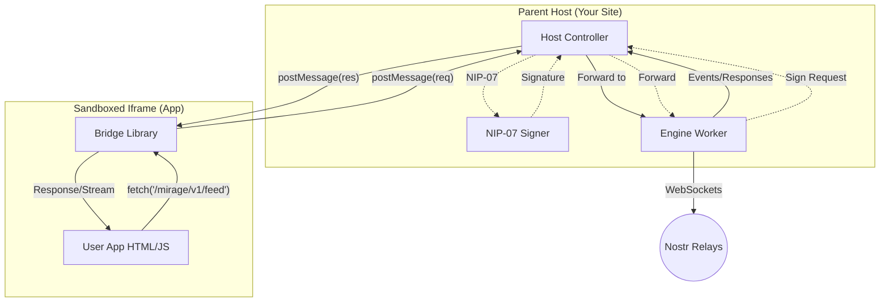
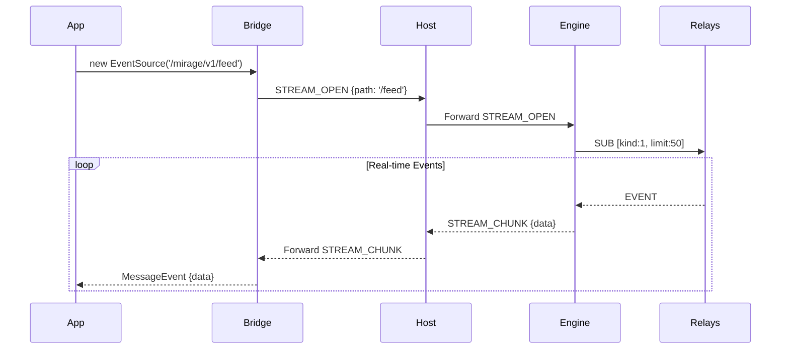
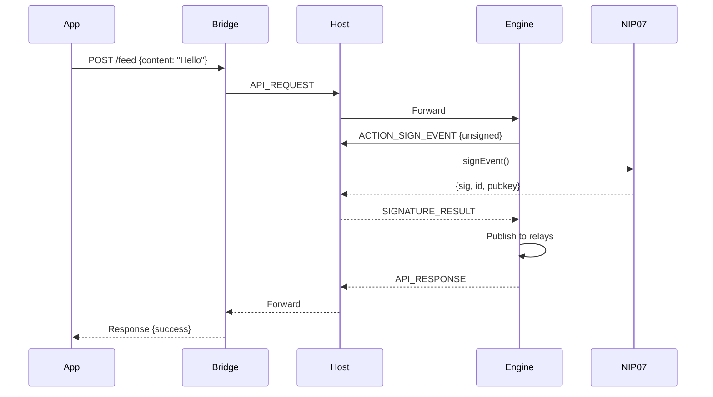

# Technical Overview: The Nostr App Engine

## 1. Executive Summary

The Nostr App Engine is a client-side platform that enables the creation and execution of "serverless" micro-apps. These apps are generated by AI, stored as Nostr events, and executed within a secure, sandboxed browser environment.

The core innovation is a **"Virtual API"** layer. This abstracts the complexity of the Nostr protocol (relays, cryptography, NIPs) into standard RESTful endpoints with real-time streaming support.

---

## 2. System Architecture

The system utilizes a **Host-Owned Engine** pattern where the parent website owns the Nostr connection, enabling background sync and persistent subscriptions.

### Component Diagram



### The Three Layers

1. **The Host (Parent Website)**
   - **Role:** The "Browser OS"
   - **Owns:** The Engine Worker (persistent across app changes)
   - **Responsibilities:** Loads apps, manages NIP-07 signing, routes messages
   - **Security:** Only layer with access to private keys

2. **The Bridge (Injected Library)**
   - **Role:** The "Interceptor"
   - **Mechanism:** Intercepts `fetch()` and `EventSource` calls to `/mirage/` namespace
   - **Modes:** 
     - **Child Mode:** Routes to parent Host via `postMessage`
     - **Standalone Mode:** Spawns own Engine Worker (for development)

3. **The Engine (Web Worker)**
   - **Role:** The "Virtual Backend"
   - **Responsibilities:** Maintains relay connections, serializes to Nostr events, manages subscriptions
   - **Streaming:** Pushes events to Bridge via `STREAM_CHUNK` messages

---

## 3. Virtual SSE (Server-Sent Events)

Mirage implements a "Virtual SSE" layer that allows apps to use standard `EventSource` for real-time data.

### How It Works



### Transport Options

| Method | Usage | Notes |
|--------|-------|-------|
| `EventSource` | `new EventSource('/mirage/v1/feed')` | Polyfilled by Bridge |
| `fetch` streaming | `fetch().then(r => r.body.getReader())` | Returns ReadableStream |

---

## 4. The Virtual API

All endpoints use the `/mirage/v1/` prefix.

### Public & Social

| Method | Endpoint | Streaming | Description |
|--------|----------|-----------|-------------|
| `GET` | `/user/me` | No | Current user profile |
| `GET` | `/users/{pubkey}` | No | User by public key |
| `GET` | `/feed` | **Yes** | Public timeline |
| `POST` | `/feed` | No | Publish a note |

### App Storage (NIP-78)

| Method | Endpoint | Description |
|--------|----------|-------------|
| `GET` | `/storage/{key}` | Retrieve stored value |
| `PUT` | `/storage/{key}` | Store/update value |
| `DELETE` | `/storage/{key}` | Delete value |

### Private Channels

| Method | Endpoint | Streaming | Description |
|--------|----------|-----------|-------------|
| `GET` | `/channels` | No | List channels |
| `GET` | `/channels/{id}/messages` | **Yes** | Channel messages |
| `POST` | `/channels/{id}/messages` | No | Send message |

### Direct Messages (NIP-17)

| Method | Endpoint | Streaming | Description |
|--------|----------|-----------|-------------|
| `GET` | `/dm` | No | List conversations |
| `GET` | `/dm/{pubkey}` | **Yes** | Get messages |
| `POST` | `/dm/{pubkey}` | No | Send message |

---

## 5. Security Model

### Origin Isolation

Apps run in an iframe with `srcdoc` and `sandbox="allow-scripts"`. This forces:
- `null` origin
- No localStorage/cookies access
- No parent DOM access

### The Signing Flow



### Permission Manifest

Apps declare required permissions:

```html
<meta name="mirage-permissions" content="public_read, storage_read, storage_write">
```

---

## 6. Implementation Status

| Phase | Status | Features |
|-------|--------|----------|
| Phase 1: Core Engine | ✅ Complete | Fetch proxy, Web Worker, NIP-01/07 |
| Phase 2: Storage | ✅ Complete | NIP-78 app data |
| Phase 3: Streaming | ✅ Complete | SSE, Host-owned Engine |
| Phase 4: Privacy | 🔄 In Progress | Encrypted channels, NIP-17 DMs |
