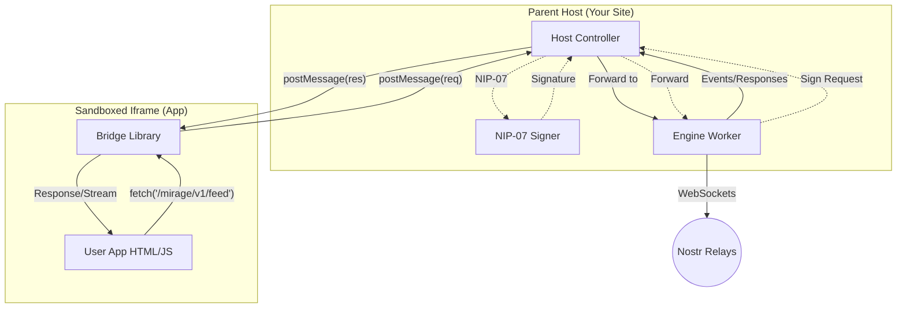
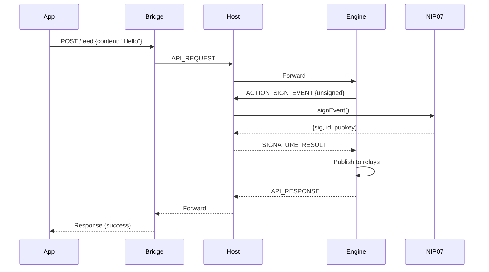

# Technical Overview: The Nostr App Engine

## 1. Executive Summary

The Nostr App Engine is a client-side platform that enables the creation and execution of "serverless" micro-apps. These apps are generated by AI, stored as Nostr events, and executed within a secure, sandboxed browser environment.

The core innovation is a **"Virtual API"** layer. This abstracts the complexity of the Nostr protocol (relays, cryptography, NIPs) into standard RESTful endpoints with real-time streaming support.

---

## 2. System Architecture

The system utilizes a **Host-Owned Engine** pattern where the parent website owns the Nostr connection, enabling background sync and persistent subscriptions.

### Component Diagram



### The Three Layers

1. **The Host (Parent Website)**
   - **Role:** The "Browser OS"
   - **Owns:** The Engine Worker (persistent across app changes)
   - **Responsibilities:** Loads apps, manages NIP-07 signing, routes messages
   - **Security:** Only layer with access to private keys

2. **The Bridge (Injected Library)**
   - **Role:** The "Interceptor"
   - **Mechanism:** Intercepts `fetch()` and `EventSource` calls to `/mirage/` namespace
   - **Modes:** 
     - **Child Mode:** Routes to parent Host via `postMessage`
     - **Standalone Mode:** Spawns own Engine Worker (for development)

3. **The Engine (Web Worker)**
   - **Role:** The "Virtual Backend"
   - **Responsibilities:** Maintains relay connections, serializes to Nostr events, manages subscriptions
   - **Streaming:** Pushes events to Bridge via `STREAM_CHUNK` messages

---

## 3. The "Virtual Database" (Shared KV Store)

A key feature for AI-generated apps is the **Shared Key-Value Store**. This allows apps to have state (like a Todo list) without needing a SQL database.

### Protocol Details
*   **Events:** Kind 42 (Channel Message)
*   **Tags:** `#t=mirage_store`
*   **Content:** `["store_put", "key_name", { "json": "value" }]`
*   **Conflict Resolution:** Last-Write-Wins (LWW) per key.

### Engine Logic
The Engine automatically "flattens" the stream of events into a single JSON object state.
1.  **Snapshot:** Engine caches the latest state.
2.  **Merge:** New events overwrite old keys based on timestamp.
3.  **Read:** `GET /spaces/:id/store` returns the clean, merged JSON.

---

## 4. The Virtual API

All endpoints use the `/mirage/v1/` prefix.

### Public & Social

| Method | Endpoint | Streaming | Description |
|--------|----------|-----------|-------------|
| `GET` | `/user/me` | No | Current user profile |
| `GET` | `/users/{pubkey}` | No | User by public key |
| `GET` | `/feed` | **Yes** | Public timeline |
| `POST` | `/feed` | No | Publish a note |

### App Storage (NIP-78)

| Method | Endpoint | Description |
|--------|----------|-------------|
| `GET` | `/storage/{key}` | Retrieve stored value |
| `PUT` | `/storage/{key}` | Store/update value (Encrypted by default) |
| `DELETE` | `/storage/{key}` | Delete value |
| *Note* | `?public=true` | Disables encryption (Essential for Vault Metadata) |

### Private Spaces (Encrypted Groups)

| Method | Endpoint | Streaming | Description |
|--------|----------|-----------|-------------|
| `GET` | `/spaces` | No | List spaces |
| `GET` | `/spaces/{id}/store` | **Yes** | **Shared Key-Value Store** (Merged State) |
| `PUT` | `/spaces/{id}/store/{key}` | No | Update a specific key |
| `GET` | `/spaces/{id}/messages` | **Yes** | Chat messages |
| `POST` | `/spaces/{id}/messages` | No | Send chat message |

### Direct Messages (NIP-17)

| Method | Endpoint | Streaming | Description |
|--------|----------|-----------|-------------|
| `GET` | `/dms` | No | List conversations |
| `GET` | `/dms/{pubkey}` | **Yes** | Get messages |
| `POST` | `/dms/{pubkey}` | No | Send message |

### Contact Lists (NIP-02)

| Method | Endpoint | Description |
|--------|----------|-------------|
| `GET` | `/contacts` | Get my follow list |
| `GET` | `/contacts/{pubkey}` | Get user's follow list |
| `PUT` | `/contacts` | Replace my follow list |

---

## 6. App Preview Mode

### Overview
Mirage includes a dedicated preview environment for testing apps before publishing them to Nostr relays. This prevents test data from polluting the network and enables rapid iteration during development.

### Architecture

When an app is mounted with the special identifier `__preview__`, the bridge intercepts all `/mirage/` API requests and routes them to an in-memory mock handler instead of the engine:

```javascript
// In Bridge (fetch.ts)
if (currentAppOrigin === '__preview__') {
    return handlePreviewRequest(method, url, body);
}
```

### Mock Data Handler

The preview mock module (`preview-mock.ts`) provides:

* **In-Memory Storage:** `Map<string, any[]>` for channel data
* **Instant POST**: Data stored immediately without signing
* **Simulated GET**: 350ms delay to mimic network latency  
* **Session Isolation:** Data persists only during preview session

### Use Cases

1. **Rapid Prototyping:** Test UI/UX without relay round-trips
2. **AI Development:** LLMs can iterate on code without real data
3. **Feature Testing:** Verify app logic before committing to network
4. **Education:** Learn Mirage API without affecting production data

---

## 7. Security Model

### Origin Isolation

Apps run in an iframe with `srcdoc` and `sandbox="allow-scripts"`. This forces:
- `null` origin
- No localStorage/cookies access
- No parent DOM access

### The Vault Pattern (Client-Side Encryption)
For high-security apps (e.g., Password Managers), we use a "Client-Side Vault" pattern.
1.  **App Logic:** User enters a password -> App derives Key -> App encrypts data.
2.  **Engine Role:** Engine receives ciphertext -> Saves to Store (Public or Space-Encrypted).
3.  **Result:** Even if the Nostr Private Key (`nsec`) is leaked, the data remains secure because the App Password was never sent to the Engine.

### The Signing Flow



---

## 8. Implementation Status

| Phase | Status | Features |
|-------|--------|----------|
| Phase 1: Core Engine | ✅ Complete | Fetch proxy, Web Worker, NIP-01/07 |
| Phase 2: Storage | ✅ Complete | NIP-78 app data, Public/Private Support |
| Phase 3: Streaming | ✅ Complete | SSE, Host-owned Engine |
| Phase 4: Spaces | ✅ Complete | Encrypted Shared Spaces, Invitation Flow |
| Phase 5: Shared Store | ✅ Complete | Virtual Database (Kind 42 LWW) |
| Phase 6: DMs/Contacts | ✅ Complete | NIP-17 DMs, NIP-02 Contacts |